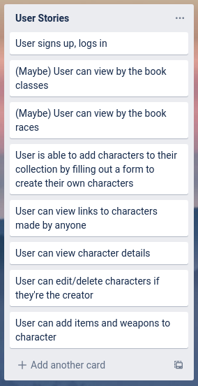
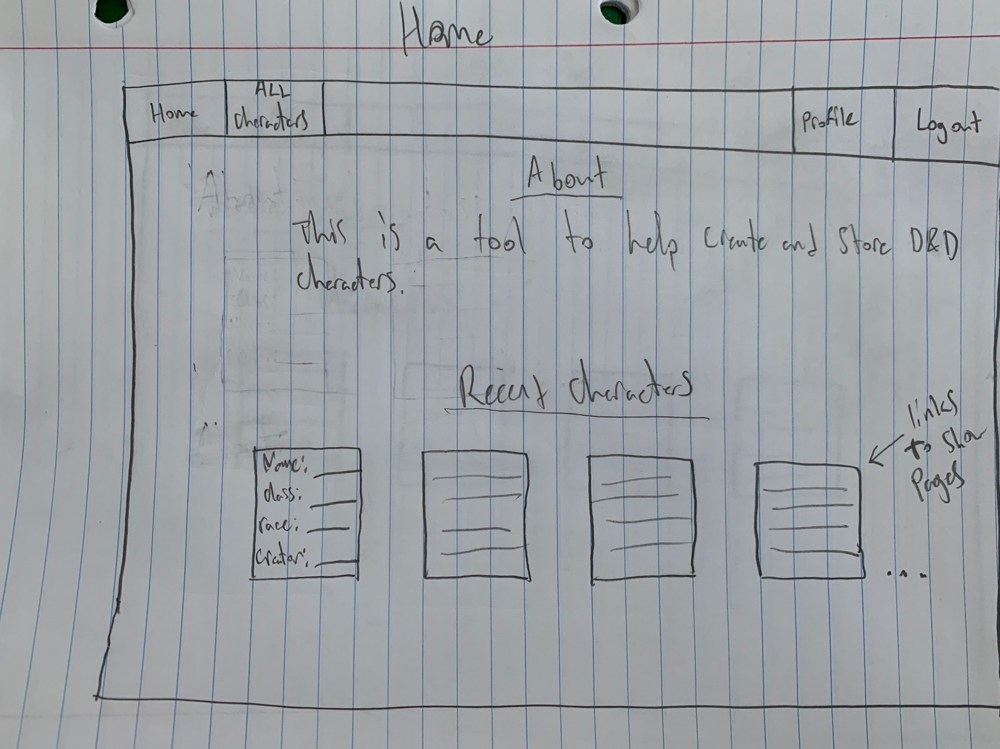
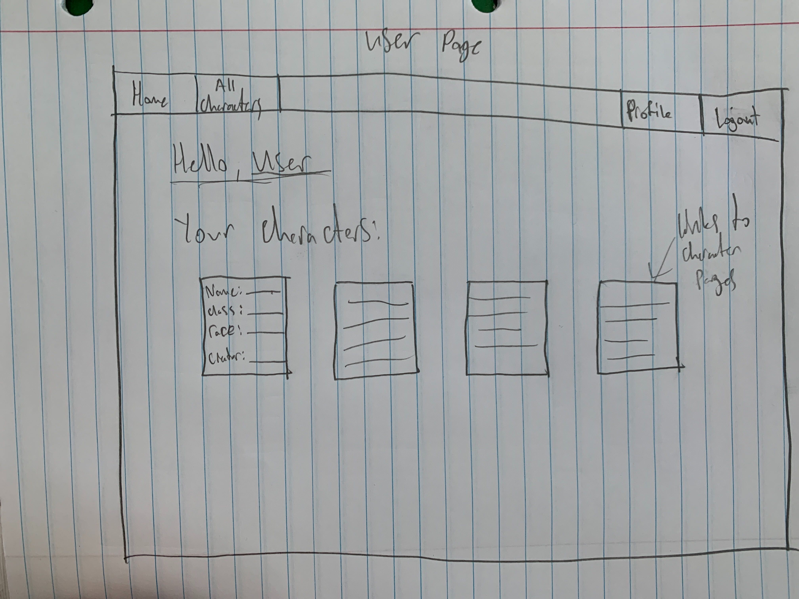
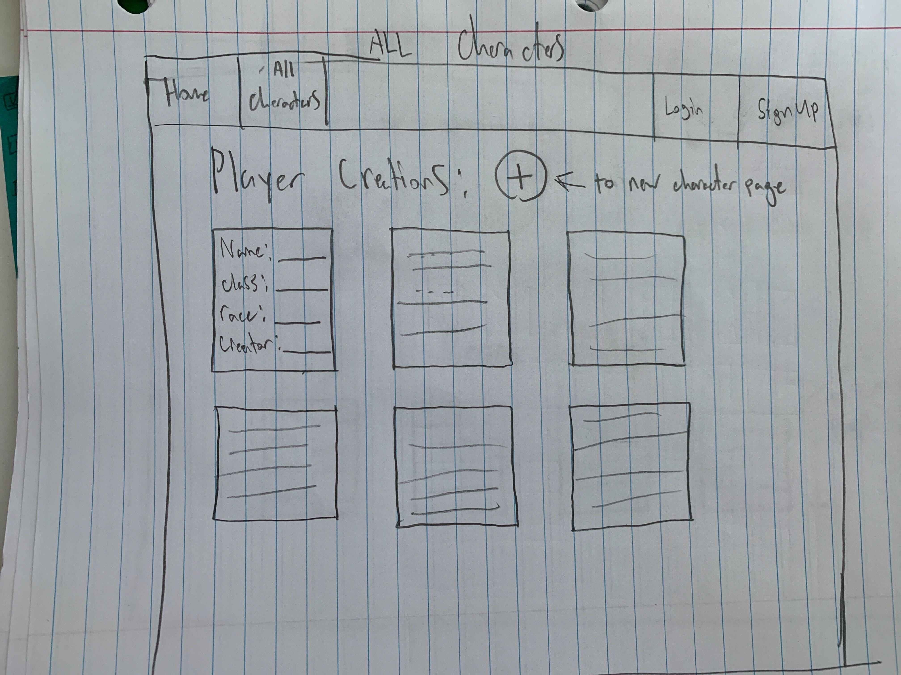
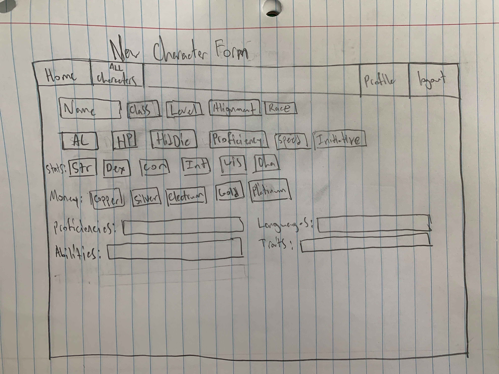
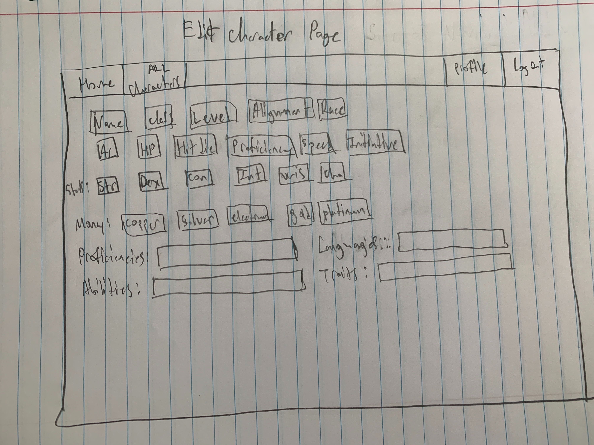
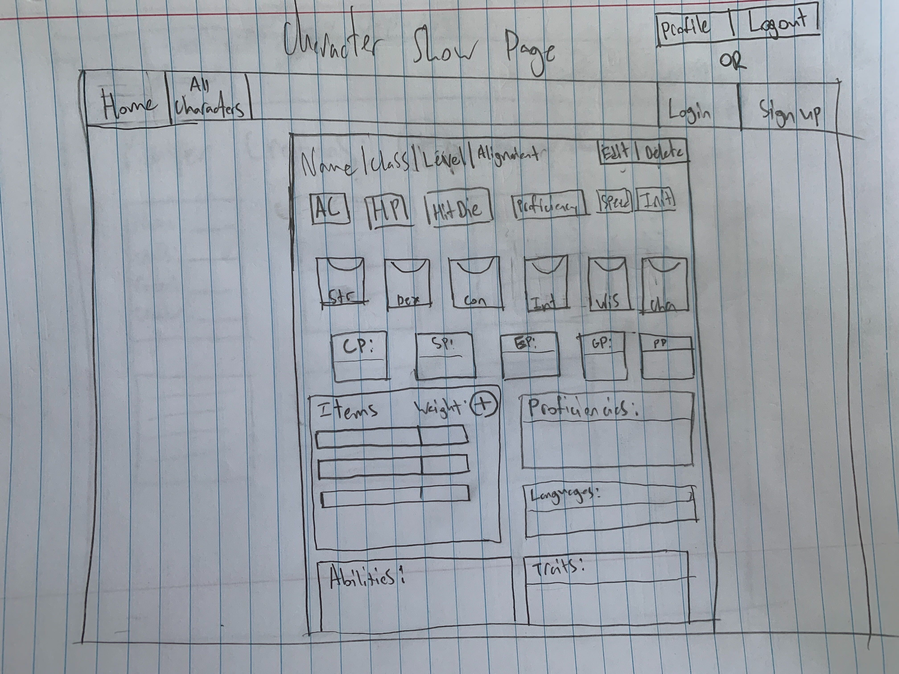
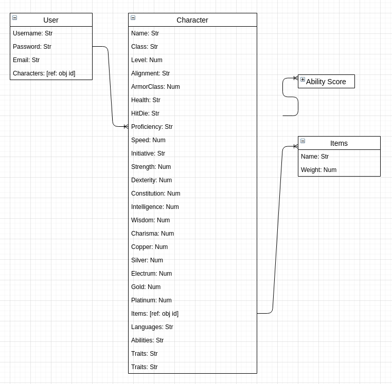

# Capstone Project --- Character Buddy

---

Live-link:  
    https://character-buddy.herokuapp.com/

---

Description:
    An app to help people create and store character sheets for their Dungeon and Dragon Campaigns. A user would also be able to add and edit items for thier character, and view other people's characters.

---

List of Technologies Used:
* Front End
    *Bootstrap
    *Jquery
* Back End
    * bcrypt
    * body parser
    * express/sessions
    * mongoDB
    * mongoose

---

User Stories, <a href="https://trello.com/b/ClfHPHig/capstone-project">My Trello With User Stories and Sprints</a>: 

---

WireFrames:

Home Page:

---

User Page:

---

All Characters:

---

New Character Page:

---

Edit Character Page:

---

Character Show Page

---

ERD:

---

Unsolved Problems/ Future Features: